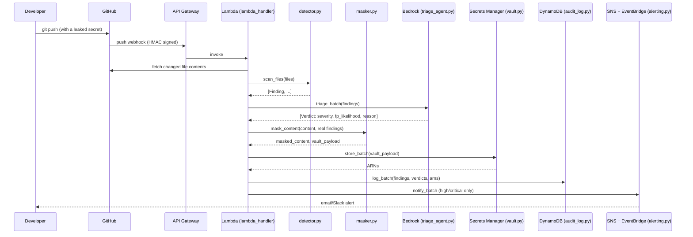

# Architecture

## Flow



## Why each AWS service is there (not just checkbox integration)

- **Lambda + API Gateway** — the whole pipeline runs serverless, triggered
  per-push. No always-on server to pay for or patch.
- **Bedrock** — this is the part that makes it an *agent*, not a linter.
  A raw regex hit is a binary signal; Bedrock reads it in context and
  returns a severity + false-positive judgement, which is what actually
  gets acted on. Falls back to a heuristic scorer
  (`GUARDRAIL_USE_BEDROCK=0`) so the pipeline is testable offline — see
  `docs/BUSINESS_REQUIREMENTS.md` for why that's disclosed, not hidden.
- **Secrets Manager** — the leaked value never touches disk or a local
  file. It's quarantined centrally where a human can rotate it, tagged
  by repo and finding type.
- **DynamoDB** — every finding + verdict + remediation action is an
  audit row. This is also the fastest thing to show on camera for the
  demo video — a live table update within seconds of a push.
- **SNS + EventBridge** — SNS for the human alert (email/Slack), EventBridge
  for anything downstream that wants to react programmatically (open a
  ticket, page on-call, trigger a rotation Lambda later).

## Why detect-and-remediate-forward instead of pre-commit blocking

A local git pre-commit hook (the original EnvShield concept this project
evolved from) blocks the secret before it ever reaches GitHub. This
pipeline is reactive — it acts within seconds *after* a push. That's a
real trade-off, made on purpose for this hackathon: pre-commit hooks run
on the developer's machine and can't produce the AWS-console evidence this
event is judged on, and the reactive model is also what real orgs use for
repos they don't fully control (forks, contractor pushes, legacy repos
without hooks installed). See `docs/BUSINESS_REQUIREMENTS.md`.

## Code layout

```
src/
  detector.py       # pure-Python regex + entropy scanning, no AWS deps
  masker.py         # replaces only the secret value, preserves formatting
  triage_agent.py   # Bedrock call + offline heuristic fallback
  vault.py          # Secrets Manager wrapper
  audit_log.py      # DynamoDB wrapper
  alerting.py       # SNS + EventBridge wrapper
  lambda_handler.py # orchestrates the above; webhook signature verification

demo/
  demo.py             # full pipeline against moto-mocked AWS, runs in <1s
  show_masked_diff.py # prints before/after masking, no AWS needed at all
  fixtures/           # fake-but-realistic leaked secrets for testing/demo

infra/
  main.tf, dynamodb.tf, lambda.tf, alerting.tf, api_gateway.tf
  build_layer.sh    # packages the Lambda dependencies layer

tests/
  test_detector.py  # 8 unit tests, detector + masker
```
